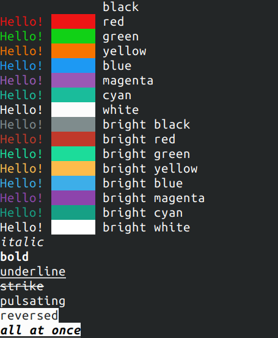

# {cfmt}

A companion C++ library for the [{fmt}](https://github.com/fmtlib/fmt) to enable text colorization and styling



## API

Simple example:

`cfmt::cprint("This is {i}italic{ni}, and this is {b}bold{nb}\n");`

All markup control symbols are in the same `{}` brackets as format arguments.
Syntax for text styles are:

```
{i}Italic{ni}
{b}Bold{nb}
{u}Underlined{nu}
{s}Striken{ns}
{p}Pulsating (blinking){np}
{r}Reversed colors{nr}

{d} returns all styles to default
```

Foreground colors are coded as `{fC}` and backround ones as `{bC}`,
where `C` is one of the color codes:

```
bk - black
r  - red
g  - green
b  - blue
y  - yellow
m  - magenta
c  - cyan
w  - white
d  - default color
```

Adding `b` before color codes makes them brighter. For example bright green foreground `{fbg}`

Implemented functions are:

```
template<class ...T>
void cprint(std::string_view fmt, T&&... args);

template<class ...T>
void cprint(std::FILE *f, std::string_view fmt, fmt::format_args args);

template<class ...T>
std::string cformat(std::string_view fmt, T&&... args);

template<typename OutputIt, typename ...T>
OutputIt cformat_to(OutputIt out, std::string_view fmt, T&&... args);
```

They have the same interface as ones from the {fmt}, but the prefix `c` in name. Also there are bonus functions, useful for making progress indicators to console

```
/// moves the cursor to the beginning of current line,
/// clearing everything in its path
void clear_to_begining_of_line()

void move_cursor_to_begining_of_line()

///moves one line up
void move_cursor_up()
```

See the `main.c++` for an example of usage

## Getting it

The library is header only, so just copy the `cfmt.h` over to your project. It requires the [{fmt}](https://github.com/fmtlib/fmt) library as dependency. See the `CMakeLists.txt` for an example of the simplest way to add it into your cmake project.

